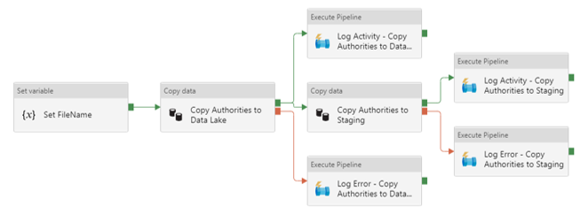

# Introduction 
This repository is one of three repositories which make up the Azure Data Factory DataOps Demonstation:

* **Infrastructure** - Contains a set of Bicep templates for provisioning all infrastructure for the demo as well as JSON exports of all the Azure DevOps Build and Release Pipelines
* **AzureSQL** - Contains the Azure SQL Database project files (SSDT) for maintaining all database objects within Visual Studio (2017-2022)
* **DataFactory** (*this repository*) - Contains all the Azure Data Factory objects (linked services, data-sets and pipelines) for this demo - this repository should be connected to the Development instance of DataFactory.

# Getting Started
TODO: instructions on deploying initial Azure Data Factory and configuration for this Git repository.

---
THIS SOFTWARE IS PROVIDED "AS IS", WITHOUT WARRANTY OF ANY KIND, EXPRESS OR
IMPLIED, INCLUDING BUT NOT LIMITED TO THE WARRANTIES OF MERCHANTABILITY,
FITNESS FOR A PARTICULAR PURPOSE AND NONINFRINGEMENT. IN NO EVENT SHALL THE
AUTHORS OR COPYRIGHT HOLDERS BE LIABLE FOR ANY CLAIM, DAMAGES OR OTHER
LIABILITY, WHETHER IN AN ACTION OF CONTRACT, TORT OR OTHERWISE, ARISING FROM,
OUT OF OR IN CONNECTION WITH THE SOFTWARE OR THE USE OR OTHER DEALINGS IN THE
SOFTWARE.

---
---

# Auto-generated documentation for adf-awb-cicddemo-dev #
 
## Summary ##
ComponentType | Count
---|---
[Datasets](#datasets)|10
[LinkedServices](#linked-services)|4
[Pipelines](#pipelines)|7
[Triggers](#triggers)|1
 
##  Data Factory Parameters: ##
 
Sequence|Name|Type|Default|Metadata
---|---|---|---|---
1|factoryName|string|ADFDEMO-Dev-DataFactory01|Data Factory name
2|LS_ASQL_ADFDEMO_DW_connectionString|secureString|*no default*|Secure string for 'connectionString' of 'LS_ASQL_ADFDEMO_DW'
3|LS_ADLS_ADFDEMO_DataLake_properties_typeProperties_url|string|https://adfdemodevsadatalake01.dfs.core.windows.net/|*no metadata*
4|LS_AKV_ADFDEMO_KeyVault_properties_typeProperties_baseUrl|string|https://ADFDEMO-Dev-KeyVault01.vault.azure.net/|*no metadata*
5|LS_REST_FHRS_API_properties_typeProperties_url|string|https://api.ratings.food.gov.uk/|*no metadata*

 
---
 
# *TRIGGERS* #
 
## **TRG_SCHD_ADFDEMO_FullRefresh_DailyOvernight** ##
Overnight daily refresh using the main pipeline to run the full ETL data loading
 
* Type: *ScheduleTrigger*
* Status: *Started*
 
 
 
---
 
# *LINKED SERVICES* #
 
Name|Type|Using Key Vault
---|---|---
[LS_ADLS_ADFDEMO_DataLake](#ls_adls_adfdemo_datalake)|AzureBlobFS|Yes
[LS_AKV_ADFDEMO_KeyVault](#ls_akv_adfdemo_keyvault)|AzureKeyVault|No
[LS_ASQL_ADFDEMO_DW](#ls_asql_adfdemo_dw)|AzureSqlDatabase|No
[LS_REST_FHRS_API](#ls_rest_fhrs_api)|RestService|No
 
## **LS_ADLS_ADFDEMO_DataLake** 
Connection to main Azure Data Lake storage account.  Accessed via account key held in key vault.
 
* Type: *AzureBlobFS*
* Using Key Vault: *Yes*
 
Referenced by: 
 
* `DS_ADLS_Common_CSV_File`
* `DS_ADLS_Common_Json_Container`
* `DS_ADLS_Common_Json_File`
 
 
 
---

## **LS_AKV_ADFDEMO_KeyVault** 
Main project Key Vault which contains connection keys for storage accounts and other secrets/credentials.
 
* Type: *AzureKeyVault*
* Using Key Vault: *No*
 
 
 
---

## **LS_ASQL_ADFDEMO_DW** 
Connection to ADFDEMO Azure SQL main Database
 
* Type: *AzureSqlDatabase*
* Using Key Vault: *No*
 
Referenced by: 
 
* `DS_ASQL_Common_Table`
* `DS_ASQL_FHRS_Authorities`
* `DS_ASQL_FHRS_Authorities_Lookup`
* `DS_ASQL_FHRS_Establishments`
* `DS_ASQL_ForTestingLogging`
 
 
 
---

## **LS_REST_FHRS_API** 
Linked service for anonymous access to the Food Hygiene Ratings Scheme API
 
* Type: *RestService*
* Using Key Vault: *No*
 
Referenced by: 
 
* `DS_REST_FHRS_Authorities`
* `DS_REST_FHRS_Establishments_By_Authority`
 
 
 
---

 
# *DATASETS* #
 
Category|Name|Type
---|---|---
Common|[DS_ADLS_Common_CSV_File](#ds_adls_common_csv_file-common)|DelimitedText
Common|[DS_ADLS_Common_Json_Container](#ds_adls_common_json_container-common)|Json
Common|[DS_ADLS_Common_Json_File](#ds_adls_common_json_file-common)|Json
Common|[DS_ASQL_Common_Table](#ds_asql_common_table-common)|AzureSqlTable
FHRS|[DS_ASQL_FHRS_Authorities](#ds_asql_fhrs_authorities-fhrs)|AzureSqlTable
FHRS|[DS_ASQL_FHRS_Authorities_Lookup](#ds_asql_fhrs_authorities_lookup-fhrs)|AzureSqlTable
FHRS|[DS_ASQL_FHRS_Establishments](#ds_asql_fhrs_establishments-fhrs)|AzureSqlTable
FHRS|[DS_REST_FHRS_Authorities](#ds_rest_fhrs_authorities-fhrs)|RestResource
FHRS|[DS_REST_FHRS_Establishments_By_Authority](#ds_rest_fhrs_establishments_by_authority-fhrs)|RestResource
Testing|[DS_ASQL_ForTestingLogging](#ds_asql_fortestinglogging-testing)|AzureSqlTable
 

## **DS_ADLS_Common_CSV_File** (*Common*) ##
Generic data-set for landing a CSV file into the main data lake for a specific container, folder pattern and filename.
 
* Type: *DelimitedText*
* Linked Service: `LS_ADLS_ADFDEMO_DataLake`
 
Referenced as Source Dataset by: 
* Copy London Placement Spend to Staging (`PL_MAIN_Costs_Load_London_Placement_Spend`)
* Copy 999 and 111 Calls to Staging (`PL_MAIN_EHCH_Load_111_And_999_Calls`)
 
## Dataset Parameters: ##
 
Sequence|Name|Type|Default
---|---|---|---
1|ContainerName|string|import
2|FolderName|string|*no default*
3|FileName|string|*no default*
 
 
 
---

## **DS_ADLS_Common_Json_Container** (*Common*) ##
Generic data-set for landing a JSon file into the main data lake for a specific container - for use with wildcard paths where the container is required in the data-set
 
* Type: *Json*
* Linked Service: `LS_ADLS_ADFDEMO_DataLake`
 
Referenced as Source Dataset by: 

 
## Dataset Parameters: ##
 
Sequence|Name|Type|Default
---|---|---|---
1|ContainerName|string|import
 
 
 
---

## **DS_ADLS_Common_Json_File** (*Common*) ##
Generic data-set for landing a JSon file into the main data lake for a specific container, folder pattern and filename.
 
* Type: *Json*
* Linked Service: `LS_ADLS_ADFDEMO_DataLake`
 
Referenced as Source Dataset by: 
* Copy Authorities to Staging (`PL_COPY_FHRS_Authorities`)
* Copy Establishments to Staging (`PL_COPY_FHRS_Establishments_By_Authority`)
 
Referenced as Destination Dataset by: 
* Copy Authorities to Data Lake (`PL_COPY_FHRS_Authorities`)
* Copy Establishments to Data Lake (`PL_COPY_FHRS_Establishments_By_Authority`)
 
## Dataset Parameters: ##
 
Sequence|Name|Type|Default
---|---|---|---
1|ContainerName|string|import
2|FolderName|string|*no default*
3|FileName|string|*no default*
 
 
 
---

## **DS_ASQL_Common_Table** (*Common*) ##
Generic data-set for an Azure SQL Database table based on the LS_ASQL_ADFDEMO_DW linked service.
 
* Type: *AzureSqlTable*
* Linked Service: `LS_ASQL_ADFDEMO_DW`
 
Referenced as Destination Dataset by: 

 
## Dataset Parameters: ##
 
Sequence|Name|Type|Default
---|---|---|---
1|Schema|string|dbo
2|Table|string|*no default*
 
 
 
---

## **DS_ASQL_FHRS_Authorities** (*FHRS*) ##
Data-set for the Staging.Authorities table in the main database for landing FHRS authorities data
 
* Type: *AzureSqlTable*
* Linked Service: `LS_ASQL_ADFDEMO_DW`
 
Referenced as Destination Dataset by: 
* Copy Authorities to Staging (`PL_COPY_FHRS_Authorities`)
 
 
 
---

## **DS_ASQL_FHRS_Authorities_Lookup** (*FHRS*) ##
SQL Data-set containing FHRS Authorities for use by Authority Lookup activity.
 
* Type: *AzureSqlTable*
* Linked Service: `LS_ASQL_ADFDEMO_DW`
 
 
 
---

## **DS_ASQL_FHRS_Establishments** (*FHRS*) ##
Data-set for the Staging.Establishments table in the main database for landing FHRS establishments data (by Authority ID)
 
* Type: *AzureSqlTable*
* Linked Service: `LS_ASQL_ADFDEMO_DW`
 
Referenced as Destination Dataset by: 
* Copy Establishments to Staging (`PL_COPY_FHRS_Establishments_By_Authority`)
 
 
 
---

## **DS_REST_FHRS_Authorities** (*FHRS*) ##
Local Authorities data-set for FHRS API
 
* Type: *RestResource*
* Linked Service: `LS_REST_FHRS_API`
 
Referenced as Source Dataset by: 
* Copy Authorities to Data Lake (`PL_COPY_FHRS_Authorities`)
 
 
 
---

## **DS_REST_FHRS_Establishments_By_Authority** (*FHRS*) ##
Establishments data-set for FHRS API based on a specific Authority ID
 
* Type: *RestResource*
* Linked Service: `LS_REST_FHRS_API`
 
Referenced as Source Dataset by: 
* Copy Establishments to Data Lake (`PL_COPY_FHRS_Establishments_By_Authority`)
 
## Dataset Parameters: ##
 
Sequence|Name|Type|Default
---|---|---|---
1|LocalAuthorityId|int|*no default*
2|BusinessTypeId|int|5
 
 
 
---

## **DS_ASQL_ForTestingLogging** (*Testing*) ##
Dataset required for the Error/Auditing Testing Pipeline
 
* Type: *AzureSqlTable*
* Linked Service: `LS_ASQL_ADFDEMO_DW`
 
Referenced as Source Dataset by: 
* Copy Data (`PL_TEST_TestErrorAndActivityLogging`)
 
Referenced as Destination Dataset by: 
* Copy Data (`PL_TEST_TestErrorAndActivityLogging`)
 
 
 
---
 
# *PIPELINES* #
 
Category|Name|Activity Count
---|---|---
.|[PL_MAIN_ADFDEMO_Full_Data_Warehouse_Load](#pl_main_adfdemo_full_data_warehouse_load)|2
Auditing|[PL_UTIL_LogPipelineActivity](#pl_util_logpipelineactivity-auditing)|1
Auditing|[PL_UTIL_LogPipelineError](#pl_util_logpipelineerror-auditing)|1
FHRS|[PL_COPY_FHRS_Authorities](#pl_copy_fhrs_authorities-fhrs)|7
FHRS|[PL_COPY_FHRS_Establishments_By_Authority](#pl_copy_fhrs_establishments_by_authority-fhrs)|8
FHRS|[PL_MAIN_FHRS_Load_Establishments_And_Authorities](#pl_main_fhrs_load_establishments_and_authorities-fhrs)|7
Testing|[PL_TEST_TestErrorAndActivityLogging](#pl_test_testerrorandactivitylogging-testing)|3
 
## **PL_MAIN_ADFDEMO_Full_Data_Warehouse_Load**  ##
Full end-to-end ADFDEMO ETL Pipeline - calls each of the MAIN level pipelines in the order configured in the SQL table, Config.ADFMainPipelines.
 
* ActivityCount: 2
 
## Pipeline Variables: ##
 
Sequence|Name|Type|Default
---|---|---|---
1|PipelineName|String|*no default*
 
## Pipeline Diagram: ##

 
## Pipeline Activities: ##
 
### 1.1 **Lookup Active Pipelines** (*Lookup*) ###
Retrieve all active top level Pipeline configuration records
 
Lookup Source Details: 
* *Stored Procedure*: `[Config].[usp_GetActiveADFMainPipelines]`
* *Dataset*: `DS_ASQL_Common_Table`
* *First Row Only*: **false**
 
 
 
 
 
### 2.1 **For Each Active Pipeline** (*ForEach*) ###
For each active top level pipeline configuration, execute the pipeline using the retrieved pipeline name.
 
For Each Iteration: 
* *Expression*: `@activity('Lookup Active Pipelines').output.value`
* *Is Sequential*: **true**
 
#### Foreach child activities: ####
 
Sequence|Name|Type|Description
---|---|---|---
1|Switch on Pipeline Name|Switch|ADF doesn't support dynamically calling pipelines using parameters, so need to create switch statement based on Pipeline name.
 
 
 
 
 
Depends on: 
 
* Lookup Active Pipelines (Succeeded)
 
 
---

## **PL_UTIL_LogPipelineActivity** (*Auditing*) ##
Generic utility pipeline for logging pipeline activity to an Azure SQL Activity Log
 
* ActivityCount: 1
 
Referenced by: 
* `PL_COPY_FHRS_Authorities`
* `PL_COPY_FHRS_Establishments_By_Authority`
* `PL_TEST_TestErrorAndActivityLogging`
 
## Pipeline Parameters: ##
 
Sequence|Name|Type|Default
---|---|---|---
1|PipelineName|string|*no default*
2|PipelineRunId|string|*no default*
3|PipelineTriggerTime|string|*no default*
4|ActivityName|string|*no default*
5|ActivityRunID|string|*no default*
6|ActivityStartTime|string|*no default*
7|ActivityMessage|string|*no default*
8|CopyActivityRowsCopied|int|0
9|CopyActivityRowsRead|int|0
10|CopyActivityDurationSeconds|int|0
11|CopyActivitySourceType|string|*no default*
12|CopyActivitySinkType|string|*no default*
13|CopyActivityExecutionStatus|string|*no default*
14|CopyActivityStartTime|string|00:00:00
 
## Pipeline Diagram: ##

 
## Pipeline Activities: ##
 
### 1.1 **Log Activity** (*SqlServerStoredProcedure*) ###
Log activity using the usp_LogADFPipelineActivity procedure
 
Stored Procedure: 
* *Name*: `[Audit].[usp_LogADFPipelineActivity]`
* *Linked Service*: `LS_ASQL_ADFDEMO_DW`
 
 
 
 
 
 
---

## **PL_UTIL_LogPipelineError** (*Auditing*) ##
Generic utility pipeline for logging pipeline activity errors to an Azure SQL Error Log
 
* ActivityCount: 1
 
Referenced by: 
* `PL_COPY_FHRS_Authorities`
* `PL_COPY_FHRS_Establishments_By_Authority`
* `PL_TEST_TestErrorAndActivityLogging`
 
## Pipeline Parameters: ##
 
Sequence|Name|Type|Default
---|---|---|---
1|PipelineName|string|*no default*
2|PipelineRunId|string|*no default*
3|PipelineTriggerTime|string|*no default*
4|ActivityName|string|*no default*
5|ActivityRunID|string|*no default*
6|ActivityStartTime|string|*no default*
7|ErrorMessage|string|*no default*
8|ErrorCode|string|*no default*
 
## Pipeline Diagram: ##

 
## Pipeline Activities: ##
 
### 1.1 **Log Error** (*SqlServerStoredProcedure*) ###
Log error using the usp_LogADFPipelineError procedure
 
Stored Procedure: 
* *Name*: `[Audit].[usp_LogADFPipelineError]`
* *Linked Service*: `LS_ASQL_ADFDEMO_DW`
 
 

---

## **PL_COPY_FHRS_Authorities** (*FHRS*) ##
Retrieve all Authorities from FHRS API and land to Data Lake and SQL table
 
* ActivityCount: 7
 
Referenced by: 
* `PL_MAIN_FHRS_Load_Establishments_And_Authorities`
 
## Pipeline Variables: ##
 
Sequence|Name|Type|Default
---|---|---|---
1|ContainerName|String|import
2|FolderName|String|FHRS/Authorities
3|FileName|String|*no default*
 
## Pipeline Diagram: ##

 
## Pipeline Activities: ##
 
### 1.1 **Set FileName** (*SetVariable*) ###
Set filename required to land JSON file
 
Variable: 
* *Name*: FileName
* *Value*: `@concat('Authorities_',formatDateTime(utcnow(),'yyyyMMddHHmmss'),'.json')`
 
 
 
 
 
### 2.1 **Copy Authorities to Data Lake** (*Copy*) ###
Retrieve all Authorities via FHRS API and land to single timestamped JSON file in Data Lake
 
Source: 
* *Type*: RestSource
* *Dataset*: `DS_REST_FHRS_Authorities`
 
Destination: 
* *Type*: JsonSink
* *Dataset*: `DS_ADLS_Common_Json_File`
 
 
 
 
 
Depends on: 
 
* Set FileName (Succeeded)
 
### 3.1 **Copy Authorities to Staging** (*Copy*) ###
Retrieve all Authorities via FHRS API and land to SQL Staging table
 
Source: 
* *Type*: JsonSource
* *Dataset*: `DS_ADLS_Common_Json_File`
 
Destination: 
* *Type*: AzureSqlSink
* *Dataset*: `DS_ASQL_FHRS_Authorities`
 
 
 
Mappings: 
 
Sequence|Source|Destination|Type
---|---|---|---
1|['LocalAuthorityId']|LocalAuthorityId|Int32
2|['LocalAuthorityIdCode']|LocalAuthorityIdCode|Int32
3|['Name']|Name|String
4|['FriendlyName']|FriendlyName|String
5|['Url']|Url|String
6|['SchemeUrl']|SchemeUrl|String
7|['Email']|Email|String
8|['RegionName']|RegionName|String
9|['FileName']|FileName|String
10|['FileNameWelsh']|FileNameWelsh|String
11|['EstablishmentCount']|EstablishmentCount|Int32
12|['CreationDate']|CreationDate|DateTime
13|['LastPublishedDate']|LastPublishedDate|DateTime
14|['SchemeType']|SchemeType|Int32
15|['links'][0]['href']|LinkHref|String
 
 
 
Depends on: 
 
* Copy Authorities to Data Lake (Succeeded)
 
### 3.2 **Log Activity - Copy Authorities to Data Lake** (*ExecutePipeline*) ###
Log Activity for Copy Authorities to Data Lake
 
Calling Pipeline: 
* *Name*: `PL_UTIL_LogPipelineActivity`
 
 
 
 
 
Depends on: 
 
* Copy Authorities to Data Lake (Succeeded)
 
### 3.3 **Log Error - Copy Authorities to Data Lake** (*ExecutePipeline*) ###
Log Errors for Copy Authorities to Data Lake
 
Calling Pipeline: 
* *Name*: `PL_UTIL_LogPipelineError`
 
 
 
 
 
Depends on: 
 
* Copy Authorities to Data Lake (Failed)
 
### 4.1 **Log Activity - Copy Authorities to Staging** (*ExecutePipeline*) ###
Log Activity for Copy Authorities to Staging
 
Calling Pipeline: 
* *Name*: `PL_UTIL_LogPipelineActivity`
 
 
 
 
 
Depends on: 
 
* Copy Authorities to Staging (Succeeded)
 
### 4.2 **Log Error - Copy Authorities to Staging** (*ExecutePipeline*) ###
Log Errors for Copy Authorities to Staging
 
Calling Pipeline: 
* *Name*: `PL_UTIL_LogPipelineError`
 
 
 
 
 
Depends on: 
 
* Copy Authorities to Staging (Failed)
 
 
---

## **PL_COPY_FHRS_Establishments_By_Authority** (*FHRS*) ##
Retrieve all Establishments for a single Authority from the FHRS API and land to Data Lake and SQL table
 
* ActivityCount: 8
 
## Pipeline Parameters: ##
 
Sequence|Name|Type|Default
---|---|---|---
1|LocalAuthorityId|int|*no default*
2|LocalAuthorityCode|string|*no default*
3|LocalAuthorityName|string|*no default*
 
## Pipeline Variables: ##
 
Sequence|Name|Type|Default
---|---|---|---
1|ContainerName|String|import
2|FolderName|String|*no default*
3|FileName|String|*no default*
 
## Pipeline Diagram: ##

 
## Pipeline Activities: ##
 
### 1.1 **Set FolderName** (*SetVariable*) ###
Set folder name required to land JSON file
 
Variable: 
* *Name*: FolderName
* *Value*: `@concat('FHRS/Establishments/',pipeline().parameters.LocalAuthorityName,' (',pipeline().parameters.LocalAuthorityCode,')')`
 
 
 
 
 
### 2.1 **Set FileName** (*SetVariable*) ###
Set filename required to land JSON file
 
Variable: 
* *Name*: FileName
* *Value*: `@concat('Establishments_',formatDateTime(utcnow(),'yyyyMMddHHmmss'),'.json')`
 
 
 
 
 
Depends on: 
 
* Set FolderName (Succeeded)
 
### 3.1 **Copy Establishments to Data Lake** (*Copy*) ###
Retrieve all Establishments for a specific Local Authority via FHRS API and land to single timestamped JSON file in Data Lake
 
Source: 
* *Type*: RestSource
* *Dataset*: `DS_REST_FHRS_Establishments_By_Authority`
 
Destination: 
* *Type*: JsonSink
* *Dataset*: `DS_ADLS_Common_Json_File`
 
 
 
 
 
Depends on: 
 
* Set FileName (Succeeded)
 
### 4.1 **Copy Establishments to Staging** (*Copy*) ###
Retrieve all Establishments for a specific Local Authority via FHRS API and land to SQL Staging table
 
Source: 
* *Type*: JsonSource
* *Dataset*: `DS_ADLS_Common_Json_File`
 
Destination: 
* *Type*: AzureSqlSink
* *Dataset*: `DS_ASQL_FHRS_Establishments`
 
 
 
Mappings: 
 
Sequence|Source|Destination|Type
---|---|---|---
1|['FHRSID']|FHRSID|Int32
2|['LocalAuthorityBusinessID']|LocalAuthorityBusinessID|String
3|['BusinessName']|BusinessName|String
4|['BusinessType']|BusinessType|String
5|['BusinessTypeID']|BusinessTypeID|Int32
6|['AddressLine1']|AddressLine1|String
7|['AddressLine2']|AddressLine2|String
8|['AddressLine3']|AddressLine3|String
9|['AddressLine4']|AddressLine4|String
10|['PostCode']|PostCode|String
11|['Phone']|Phone|String
12|['RatingValue']|RatingValue|String
13|['RatingKey']|RatingKey|String
14|['RatingDate']|RatingDate|DateTime
15|['LocalAuthorityCode']|LocalAuthorityCode|Int32
16|['LocalAuthorityName']|LocalAuthorityName|String
17|['LocalAuthorityWebSite']|LocalAuthorityWebSite|String
18|['LocalAuthorityEmailAddress']|LocalAuthorityEmailAddress|String
19|['scores']['Hygiene']|HygieneScore|Int32
20|['scores']['Structural']|StructuralScore|Int32
21|['scores']['ConfidenceInManagement']|ConfidenceInManagementScore|Int32
22|['SchemeType']|SchemeType|String
23|['geocode']['longitude']|Longitude|Decimal
24|['geocode']['latitude']|Latitude|Decimal
25|['RightToReply']|RightToReply|String
26|['Distance']|Distance|Decimal
27|['NewRatingPending']|NewRatingPending|String
28|['links'][0]['href']|LinkHREF|String
 
 
 
Depends on: 
 
* Copy Establishments to Data Lake (Succeeded)
 
### 4.2 **Log Activity - Copy Establishments to Data Lake** (*ExecutePipeline*) ###
Log Activity for Copy Establishments to Data Lake
 
Calling Pipeline: 
* *Name*: `PL_UTIL_LogPipelineActivity`
 
 
 
 
 
Depends on: 
 
* Copy Establishments to Data Lake (Succeeded)
 
### 4.3 **Log Error - Copy Establishments to Data Lake** (*ExecutePipeline*) ###
Log Errors for Copy Establishments to Data Lake
 
Calling Pipeline: 
* *Name*: `PL_UTIL_LogPipelineError`
 
 
 
 
 
Depends on: 
 
* Copy Establishments to Data Lake (Failed)
 
### 5.1 **Log Activity - Copy Establishments to Staging** (*ExecutePipeline*) ###
Log Activity for Copy Establishments to Staging
 
Calling Pipeline: 
* *Name*: `PL_UTIL_LogPipelineActivity`
 
 
 
 
 
Depends on: 
 
* Copy Establishments to Staging (Succeeded)
 
### 5.2 **Log Error - Copy Establishments to Staging** (*ExecutePipeline*) ###
Log Errors for Copy Establishments to Staging
 
Calling Pipeline: 
* *Name*: `PL_UTIL_LogPipelineError`
 
 
 
 
 
Depends on: 
 
* Copy Establishments to Staging (Failed)
 
 
---

## **PL_MAIN_FHRS_Load_Establishments_And_Authorities** (*FHRS*) ##
Main pipeline for ingesting Establishments and Authorities using the Food Hygience Rating Scheme (FHRS) API.  This currently retrieves only Caring type establishments in the London region.
 
* ActivityCount: 7
 
## Pipeline Diagram: ##

 
## Pipeline Activities: ##
 
### 1.1 **Initialise FHRS Load** (*SqlServerStoredProcedure*) ###
Clear down the Staging tables for Establishments and Authorities and any other initialisation processing
 
Stored Procedure: 
* *Name*: `[Staging].[usp_InitialiseFHRSLoading]`
* *Linked Service*: `LS_ASQL_ADFDEMO_DW`
 
 
 
 
 
### 2.1 **Copy All Authorities** (*ExecutePipeline*) ###
Calls the Authority copy pipeline.
 
Calling Pipeline: 
* *Name*: `PL_COPY_FHRS_Authorities`
 
 
 
 
 
Depends on: 
 
* Initialise FHRS Load (Succeeded)
 
### 3.1 **Load Authorities from Staging** (*SqlServerStoredProcedure*) ###
Merge the Staged Authorities table into the final destination FHRS.Authorities table
 
Stored Procedure: 
* *Name*: `[Staging].[usp_LoadFHRSAuthoritiesFromStaging]`
* *Linked Service*: `LS_ASQL_ADFDEMO_DW`
 
 
 
 
 
Depends on: 
 
* Copy All Authorities (Succeeded)
 
### 4.1 **Lookup London Authorities** (*Lookup*) ###
Retrieve all FHRS Authorities based in London Region
 
Lookup Source Details: 
* *Stored Procedure*: `[FHRS].[usp_GetLocalAuthoritiesLookupData]`
* *Dataset*: `DS_ASQL_FHRS_Authorities_Lookup`
* *First Row Only*: **false**
 
 
 
 
 
Depends on: 
 
* Load Authorities from Staging (Succeeded)
 
### 5.1 **For Each Authority** (*ForEach*) ###
Iterate through each of the authorites returned by the Lookup activity
 
For Each Iteration: 
* *Expression*: `@activity('Lookup London Authorities').output.value`
* *Is Sequential*: **true**
 
#### Foreach child activities: ####
 
Sequence|Name|Type|Description
---|---|---|---
1|Copy Establishments for Single Authority|ExecutePipeline|Calls the Establishment copy pipeline passing to it the Local Authority parameters.
 
 
 
 
 
Depends on: 
 
* Lookup London Authorities (Succeeded)
 
### 6.1 **Load Establishments from Staging** (*SqlServerStoredProcedure*) ###
Merge the Staged Establishments table into the final destination FHRS.Establishments table
 
Stored Procedure: 
* *Name*: `[Staging].[usp_LoadFHRSEstablishmentsFromStaging]`
* *Linked Service*: `LS_ASQL_ADFDEMO_DW`
 
 
 
 
 
Depends on: 
 
* For Each Authority (Succeeded)
 
### 7.1 **Match Establishments with Location** (*SqlServerStoredProcedure*) ###
Update the FHRS.Establishments table with with LocationCQCID matched against the Dim.Location table
 
Stored Procedure: 
* *Name*: `[FHRS].[usp_MatchEstablishmentsToCQCLocations]`
* *Linked Service*: `LS_ASQL_ADFDEMO_DW`
 
 
 
 
 
Depends on: 
 
* Load Establishments from Staging (Succeeded)
 
 
---

## **PL_TEST_TestErrorAndActivityLogging** (*Testing*) ##
Pipeline for Testing Purposes only - can either log pipeline activity or errors based on the parameter passsed to the pipeline (0 to raise error)
 
* ActivityCount: 3
 
## Pipeline Parameters: ##
 
Sequence|Name|Type|Default
---|---|---|---
1|SetToZeroToError|int|1
 
## Pipeline Diagram: ##

 
## Pipeline Activities: ##
 
### 1.1 **Copy Data** (*Copy*) ###
Perform a test copy by retrieving some data and then using a SQL query as the sink - which either suceeds or fails.  To fail, the parameter is set to zero to force the query to perform a divide by zero error.
 
Source: 
* *Type*: AzureSqlSource
* *Dataset*: `DS_ASQL_ForTestingLogging`
 
Destination: 
* *Type*: AzureSqlSink
* *Dataset*: `DS_ASQL_ForTestingLogging`
 
 
 
Mappings: 
 
Sequence|Source|Destination|Type
---|---|---|---
1||ActivityProcessID|Int16
2||ActivityUserName|String
3||ActivityProc|String
4||ActivityCategory|String
5||ActivityMessage|String
6||ActivityRowsAffected|Int64
7||ActivityDate|DateTime
 
 
 
### 2.1 **Log Activity** (*ExecutePipeline*) ###
If the query was successful, then logs the activity
 
Calling Pipeline: 
* *Name*: `PL_UTIL_LogPipelineActivity`
 
 
 
 
 
Depends on: 
 
* Copy Data (Succeeded)
 
### 2.2 **Log Error** (*ExecutePipeline*) ###
If the query has failed, then logs the error.
 
Calling Pipeline: 
* *Name*: `PL_UTIL_LogPipelineError`
 
 
 
 
 
Depends on: 
 
* Copy Data (Failed)
